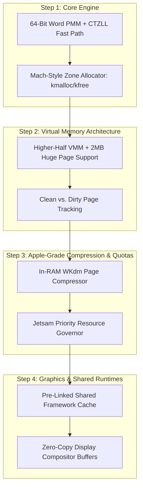

# AuraOS Memory Architecture Blueprint: An Apple/Darwin-Inspired Design

**Document Date:** September 19, 2026  
**Status:** Comprehensive Architecture Proposal & Roadmap  
**Target:** AuraOS Kernel Memory Subsystem (PMM, VMM, Kernel Heap, Userland VM)  
**Location:** `docs/devdocs/report/auraos_memory_architecture_blueprint.md`

---

## Executive Summary

Based on an audit of the current AuraOS Stage 1 kernel code alongside the technical analysis of iOS/Darwin memory management documented in [`docs/devdocs/ios_memory_architecture_report.md`](file:///f:/devlounge/AuraOS/docs/devdocs/ios_memory_architecture_report.md), this document presents a practical, phased blueprint to upgrade AuraOS into an ultra-low-overhead, high-performance, deterministic operating system.

AuraOS’s guiding philosophy:
> **Clean. Simple. Small. Fast. Direct.**

Rather than building a bulky clone of Linux/Windows memory subsystems (bloated swapping, heavy heuristic OOM killers, and unbounded garbage collection), AuraOS will adopt the **Zero-Waste / Bounded-Footprint Model** pioneered by Apple XNU:
1. **Zero Secondary Storage Swap Thrashing** — In-RAM lightweight compression (WKdm) instead of slow disk paging.
2. **Segregated Slab & Zone Allocation** — $O(1)$ allocation with near-zero metadata overhead.
3. **Clean vs. Dirty Tracking** — Discard read-only pages at zero cost; compress dirty pages only under pressure.
4. **Deterministic Budgeting (Jetsam)** — Hard per-task memory limits with strict priority bands; no UI stutter or unbounded background leaks.
5. **Zero-Copy Framebuffering** — Single-buffer ownership passing across drivers, compositor, and userland.

---

## 1. Comparative Analysis: Current AuraOS vs. iOS Model vs. Proposed Architecture

| Subsystem / Layer | Current AuraOS (v0.1.0 Baseline) | iOS / Darwin (XNU Model) | Proposed AuraOS Architecture |
| :--- | :--- | :--- | :--- |
| **Physical Page Allocation (PMM)** | Bit-by-bit linear scan ($O(N)$), division/modulo arithmetic | Segregated Mach page queues (`free`, `active`, `inactive`) | **Word-Accelerated PMM** (64-bit blocks, `__builtin_ctzll` $O(1)$ bit search, rotating pointer) |
| **Kernel Dynamic Heap** | None (only raw 4 KB frames from PMM) | Segregated `zalloc` / `kalloc` zone pools (Nano/Tiny/Small) | **Aura `zalloc` Zone Allocator** (Power-of-2 slabs: 16B..2048B, intrusive freelist, $0$ byte metadata) |
| **Virtual Memory (VMM)** | Identity mapped 1 GB, direct pointer casting, no huge pages | Multi-level 4-level paging, Higher-Half Direct Map (HHDM), Large page folding | **Higher-Half VMM + 2MB Huge Page Folding** + clean/dirty tracking bits |
| **Page Eviction & Reclamation** | None (leaks stay allocated forever) | Zero disk swap; In-RAM **WKdm** compressor + compressed segments | **In-RAM WKdm Compressed Paging Engine** (2.5:1 ratio, 0 byte disk write) |
| **Out-of-Memory / Quota Governor** | None (hangs or panics) | Priority-banded **Jetsam** killer (`SIGKILL` before frame drop) | **Aura Jetsam Governor** (Foreground, Background, System bands with active quotas) |
| **Shared Libraries & Frameworks** | Static ELF linking | Monolithic **`dyld_shared_cache`** (pre-relocated, 100% clean pages) | **Pre-linked Read-Only Shared Blob** mapped read-only into all address spaces |
| **Display & Compositing Memory** | Linear VGA framebuffer or multiboot direct buffer | Tile-Based Deferred Rendering (TBDR) + `IOSurface` zero-copy | **Zero-Copy Double Buffer** directly memory-mapped between compositor and kernel |

---

## 2. Detailed Subsystem Specifications

### 2.1 Layer 1: Hardware-Accelerated PMM (Physical Memory)

* **Current Limitation:** `pmm_alloc_frame()` tests memory 1 bit at a time. On a 4 GB machine, finding a free frame in fragmented memory can take up to 1,048,576 loop iterations.
* **Apple-Inspired Design:**
  1. Treat the bitmap as an array of `uint64_t` words.
  2. If a word is `0xFFFFFFFFFFFFFFFFULL`, skip all 64 frames in **one instruction**.
  3. When an unallocated word is found (`~word != 0`), find the target bit in **1 clock cycle** using the x86 `tzcnt` / `bsfq` instruction via `__builtin_ctzll(~word)`.
  4. Maintain `last_free_word_hint` so repeated allocations do not re-scan known full regions.
  5. Dynamically locate the bitmap immediately after `_end` (kernel binary end) instead of hardcoding `0x20000`, protecting BIOS low-memory structures.

```c
/* Fast-path PMM frame allocator */
uintptr_t pmm_alloc_frame_fast(void) {
    for (size_t i = last_free_word_hint; i < total_words; i++) {
        if (bitmap_words[i] != 0xFFFFFFFFFFFFFFFFULL) {
            int bit = __builtin_ctzll(~bitmap_words[i]);
            bitmap_words[i] |= (1ULL << bit);
            used_frames++;
            last_free_word_hint = i;
            return (uintptr_t)((i * 64 + (size_t)bit) * PAGE_SIZE);
        }
    }
    /* Wrap-around scan if needed ... */
    return 0; /* Out of physical memory */
}
```

---

### 2.2 Layer 2: Mach-Style Kernel Zone Allocator (`zalloc` / `kmalloc`)

* **Problem:** Currently, kernel structures (such as page tables, task descriptors, IPC queues) have to allocate an entire 4,096-byte frame even if they only need 32 or 64 bytes.
* **Apple-Inspired Design:**
  - Implement a segregated zone allocator with standard size classes: `16, 32, 64, 128, 256, 512, 1024, 2048` bytes.
  - Carve physical 4KB pages into uniform object slots.
  - **Zero Metadata Overhead:** The free-list pointer is stored *inside the body of the freed object* itself (`struct zone_freelist { struct zone_freelist *next; };`).
  - Allocation and deallocation are strictly **$O(1)$** (one pointer pop, one pointer push).

```c
void *zalloc(struct zone *z) {
    if (!z->free_head) {
        zone_grow(z); /* Pull a fresh 4KB frame from PMM and split it into slots */
    }
    void *obj = z->free_head;
    z->free_head = *(void **)obj;
    z->allocated_count++;
    return obj;
}

void zfree(struct zone *z, void *obj) {
    *(void **)obj = z->free_head;
    z->free_head = obj;
    z->allocated_count--;
}
```

---

### 2.3 Layer 3: Clean vs. Dirty Memory & In-RAM WKdm Compressor

* **Apple-Inspired Design:**
  - Tag memory pages during mapping:
    - **Clean (`PTE_CLEAN`):** Read-only executable code or read-only constant data. When RAM pressure occurs, the kernel can discard clean pages immediately without writing anywhere. If accessed later, they fault back in.
    - **Dirty (`PTE_DIRTY`):** Heaps, stacks, modified buffers.
  - **In-RAM Page Compressor (WKdm):**
    Instead of swapping to disk/flash, dirty pages are passed through a Wilson-Kaplan (WKdm) or LZ4 compressor:
    - WKdm is specifically tuned for x86/ARM memory word patterns (frequent zeros, small integers, clustered pointers).
    - Compresses a 4 KB page in ~1.5 microseconds.
    - Achieves an average **2.5:1 to 3:1 compression ratio**, effectively turning a 256 MB or 512 MB machine into the equivalent of 700 MB–1.5 GB of usable memory with zero I/O disk latency.

---

### 2.4 Layer 4: Aura Jetsam Priority Governor

* **Problem:** In Linux/Windows, when memory is exhausted, the system locks up in heavy disk thrashing, frame drops occur, and an unpredictable OOM heuristic eventually kills arbitrary processes.
* **Apple-Inspired Design:**
  - Define deterministic priority bands:
    ```
    Band 0:  Suspended / Idle background apps (First to terminate)
    Band 1:  Background service daemons
    Band 2:  Foreground active application
    Band 3:  System Core (Window compositor, Shell, Kernel)
    ```
  - Assign hard dirty memory limits (e.g. Foreground App = 64 MB, Background App = 16 MB).
  - If an application crosses its quota, the kernel terminates it cleanly (`SIGKILL`) **instantly**, maintaining a completely smooth 60 FPS / 120 FPS UI for the user.

---

### 2.5 Layer 5: Pre-linked Shared Framework Cache (Aura Shared Cache)

* **Problem:** Spawning multiple processes that load shared libraries typically wastes memory on per-process symbol relocation tables and writable GOT/PLT pages.
* **Apple-Inspired Design (`dyld_shared_cache`):**
  - All Aura standard libraries (`libaura`, `libui`, `libcore`) are bundled into a single pre-linked contiguous binary image at build time.
  - All virtual method addresses and cross-library calls are pre-resolved to fixed virtual addresses.
  - The shared cache is mapped with `mmap` copy-on-write across all user processes.
  - **Memory Impact:** 50 running applications consume the exact same physical RAM for core libraries as 1 application.

---

## 3. AuraOS Implementation Roadmap



### Phase 2 Execution Plan (Immediate Next Steps)
1. **PMM 64-bit Word Scan & `ctzll` Fast Path:**
   - Update [`kernel/core/pmm.c`](file:///f:/devlounge/AuraOS/kernel/core/pmm.c) to scan 64-bit blocks with bit-searching.
   - Switch PMM bitmap placement from fixed `0x20000` to dynamic placement after kernel `_end`.
2. **Implement Kernel Zone Allocator (`kernel/core/zone.c`):**
   - Provide `zalloc_init()`, `kmalloc(size)`, and `kfree(ptr)` with power-of-two slab zones.
3. **Verify with automated unit tests & QEMU boots:**
   - Run `testing/run_qemu.bat` to ensure Stage 1 boot benchmarks pass cleanly and log verification outputs.

---

*Report filed in `docs/devdocs/report/auraos_memory_architecture_blueprint.md`.*
