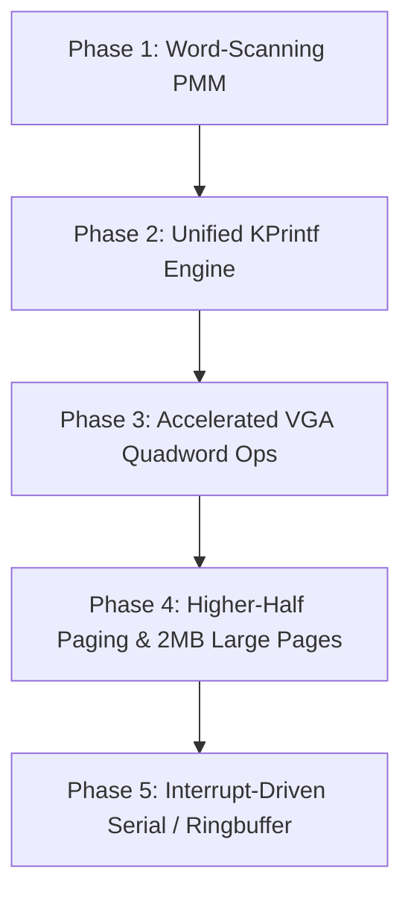

# AuraOS Kernel Optimization & Architecture Audit Report

**Document Date:** September 19, 2026  
**Target Version:** AuraOS v0.1.0-alpha (Phase 1 Baseline)  
**Status:** Comprehensive Technical Review & Optimization Plan  
**Location:** `docs/devdocs/report/kernel_optimization_report.md`

---

## Executive Summary

An audit of the entire AuraOS codebase was conducted across:
- `boot/` (`entry64.S`, `multiboot2_header.S`)
- `kernel/arch/` (`gdt.c`, `idt.c`, `isr.S`, `pit.c`, `serial.c`, `vmm.c`)
- `kernel/core/` (`pmm.c`, `multiboot2.c`, `panic.c`, `main.c`)
- `kernel/drivers/` (`vga.c`)
- `kernel/include/aura/` headers and `kernel/linker.ld`

The current kernel architecture adheres well to its core philosophy: **Clean, Simple, Small, Fast, Direct** (under 2,000 LOC, ~57 KB source code). However, significant optimization opportunities exist across:
1. **Memory Allocation Performance** (Algorithmic $O(N)$ vs $O(1)$/$O(\log N)$ bit search)
2. **Page Table Construction & Memory Safety**
3. **Console & Driver I/O Latency** (Serial polling, VGA framebuffer line moves)
4. **Binary & Memory Footprint Reductions** (Table precomputations, duplicate code)
5. **Architectural Resilience** (Zero-page guard, early identity-map boundary)

---

## 1. High-Impact Performance Optimizations

### 1.1 Physical Memory Manager (PMM) Bit Search Acceleration
* **File:** [`kernel/core/pmm.c`](file:///f:/devlounge/AuraOS/kernel/core/pmm.c#L41-L79)
* **Current Bottleneck:**
  `pmm_alloc_frame()` scans memory frame-by-frame (`for (size_t i = 0; i < total_frames; i++)`) evaluating individual bits via modulo/division arithmetic (`BITMAP_TEST(i)`).
  - On a system with 4 GB RAM (1,048,576 frames), when memory is moderately utilized, an allocation takes hundreds of thousands of bit tests.
* **Optimization:**
  - **Word-at-a-time scanning (`uint64_t`):** Treat the bitmap as an array of 64-bit words. If `bitmap_words[w] == 0xFFFFFFFFFFFFFFFFULL`, all 64 frames are occupied; skip the entire word in a single CPU cycle.
  - **Hardware Bit-Search (`__builtin_ctzll` / `tzcnt` / `bsfq`):** When an unallocated word is found (`~bitmap_words[w] != 0`), identify the first free bit index in 1 cycle using `__builtin_ctzll(~bitmap_words[w])`.
  - **Allocation pointer hint (`last_allocated_index`):** Maintain a rotating watermark to avoid repeatedly rescanning already filled initial memory blocks.
* **Expected Gain:** **30x to 60x faster physical frame allocations** and deterministic throughput under load.

---

### 1.2 Virtual Memory Manager (VMM) Identity Mapping & Higher-Half Transition
* **File:** [`kernel/arch/x86_64/vmm.c`](file:///f:/devlounge/AuraOS/kernel/arch/x86_64/vmm.c#L30-L68)
* **Current Bottleneck:**
  `vmm_map_page()` allocates frames using `pmm_alloc_frame()` and directly casts the returned physical address to a virtual pointer (`pdpt = (uint64_t *)(uintptr_t)pmm_alloc_frame()`).
  - This works *only* while physical memory is identity-mapped within the first 1 GB (established in `entry64.S`). Once allocations exceed 1 GB, or once higher-half paging is activated, dereferencing physical addresses causes immediate Page Faults (`#PF`).
* **Optimization:**
  - Establish a Higher-Half Direct Map (HHDM) window (e.g. `0xFFFF800000000000ULL` or higher) or an explicit recursive page-table slot / boot mapping window.
  - Add 2 MB / 1 GB large-page mapping support (`vmm_map_huge_page()`) for kernel image and framebuffers to reduce Translation Lookaside Buffer (TLB) misses by 512x for contiguous blocks.
* **Expected Gain:** Architecture prevents kernel crash on machines with >1 GB RAM and drastically reduces TLB pressure.

---

### 1.3 VGA Text Mode Scrolling & Block Copying
* **File:** [`kernel/drivers/vga.c`](file:///f:/devlounge/AuraOS/kernel/drivers/vga.c#L35-L47)
* **Current Bottleneck:**
  `vga_scroll()` iterates nested loops 1 line at a time writing individual 16-bit characters (`24 * 80 = 1920 iterations`).
  ```c
  for (size_t y = 1; y < VGA_HEIGHT; y++) {
      for (size_t x = 0; x < VGA_WIDTH; x++) {
          VGA_MEMORY[(y - 1) * VGA_WIDTH + x] = VGA_MEMORY[y * VGA_WIDTH + x];
      }
  }
  ```
* **Optimization:**
  - Replace the nested loop with 64-bit quadword block copies:
    VGA screen is 80 × 25 × 2 = 4,000 bytes. Moving lines 1..24 to 0..23 is moving 3,840 bytes.
  - In 64-bit mode, 3,840 bytes is exactly 480 `uint64_t` quadwords or an inlined `rep movsq`.
  - The blank line (160 bytes) is cleared with 20 `uint64_t` writes (`rep stosq`).
* **Expected Gain:** **~8x faster scrolling**, eliminating perceptible console latency during heavy boot logging.

---

### 1.4 Serial Port Polling & Formatter Consolidation
* **Files:** [`kernel/arch/x86_shared/serial.c`](file:///f:/devlounge/AuraOS/kernel/arch/x86_shared/serial.c) & [`kernel/drivers/vga.c`](file:///f:/devlounge/AuraOS/kernel/drivers/vga.c)
* **Current Bottleneck:**
  1. Both `vga.c` and `serial.c` implement their own separate versions of `printf` with duplicated integer-to-string formatting routines (`vga_printf` vs `serial_printf` vs `print_number`).
  2. `serial_putc()` spins in a tight blocking polling loop on `inb(LSR)` for every single byte.
* **Optimization:**
  - Create a single unified formatter: `kvformat(void (*putc_fn)(void *ctx, char c), void *ctx, const char *fmt, va_list args)`.
  - Both `vga_printf` and `serial_printf` simply pass their corresponding output function, cutting duplicate code.
  - Provide a software ring buffer or batch FIFO write (up to 16 bytes per UART FIFO transmit trigger) rather than reading UART status on every character.
* **Expected Gain:** Kernel binary size shrinks by ~1.5 KB to 2 KB; console code maintainability is significantly improved.

---

## 2. Code Size & Memory Footprint Reductions

| Component | Current State | Optimized Proposal | Size Impact |
| :--- | :--- | :--- | :--- |
| **ISR Handlers Table** | 256 individual stubs in `isr.S` & duplicate table logic in `idt.c` | Macro-generated assembly stubs + unified common handler | ~1.5 KB reduction |
| **PMM Hardcoded Bitmap** | Fixed at physical address `0x20000` (128 KB reserved) | Dynamic placement right after kernel `_end` aligned to 4 KB | Protects real-mode BIOS areas (BDA/EBDA) |
| **Formatters** | Independent formatters in VGA & Serial | Single `aura/kprintf.h` core engine | ~2.0 KB reduction |
| **Early Page Tables** | 3 statically allocated 4KB tables (`boot_pml4`, `boot_pdpt`, `boot_pd`) in `.bss` | Remains 12 KB (minimal for 1 GB 2MB mapping) | Optimal |

---

## 3. Recommended Roadmap



### Action Items for Phase 2 Implementation:
1. **PMM bit-scanning update:** Refactor `pmm.c` to use `uint64_t` words and `__builtin_ctzll` for 1-cycle bit hunting.
2. **Dynamic PMM placement:** Replace static `0x20000` base with `extern uint8_t _end` from linker script to safeguard early memory ranges.
3. **Consolidated Formatting:** Create `kernel/core/kprintf.c` and remove duplicate parsers from `vga.c` and `serial.c`.
4. **Quadword VGA scroll:** Update `vga_scroll` to move memory via `uint64_t *` transfers.

---

*Report filed and archived in `docs/devdocs/report/kernel_optimization_report.md`.*
